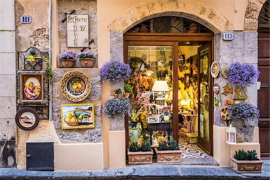
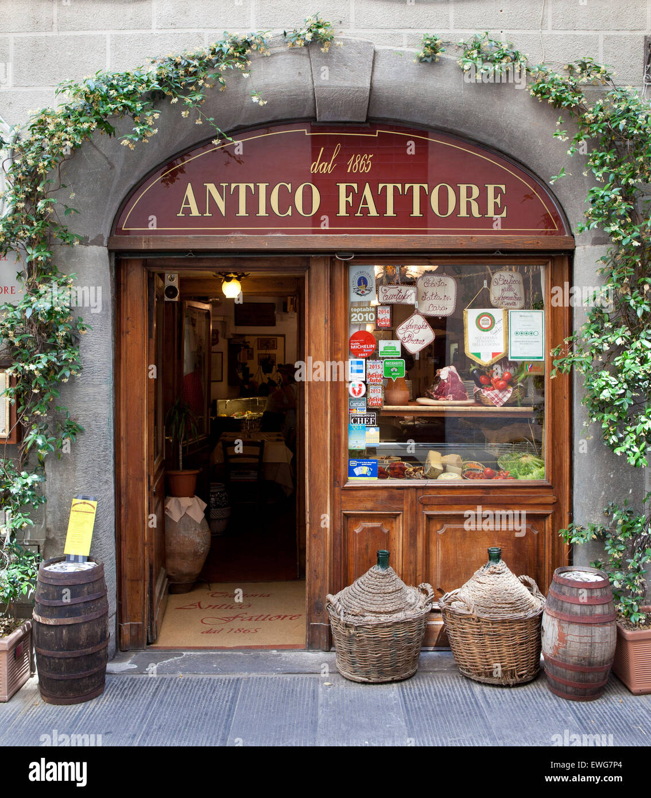
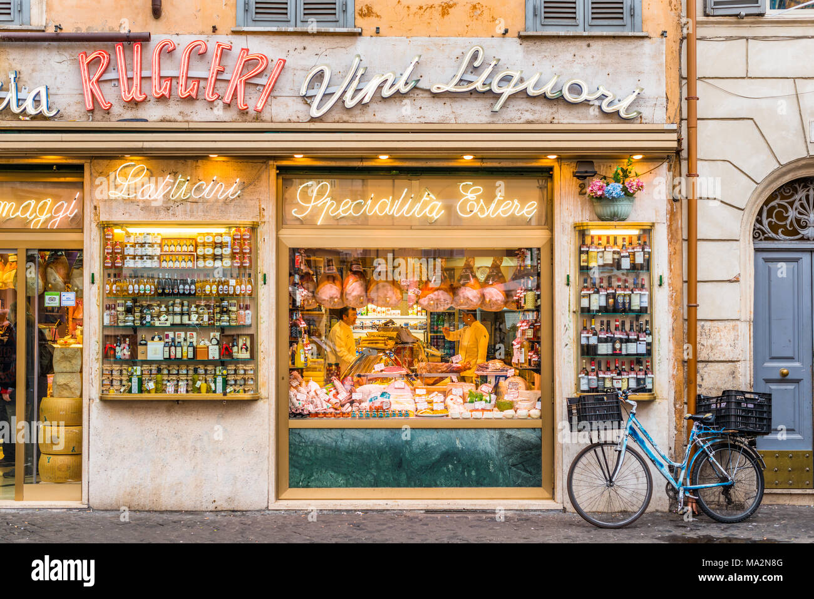

[**<< Go back**](../../Task%20flow.md)
# Italy
Italy is known for its rich cultural heritage, and this is reflected in various unique elements associated with storefronts throughout the country. Here are some of the cultural elements you might find in Italian storefronts:

1. **Artistic Facades**: Italian storefronts often feature beautifully decorated facades, sometimes adorned with `intricate frescoes`, `colorful tiles`, or `ornate stonework`. These artistic elements reflect Italy's historical emphasis on art and aesthetics.

2. **Family-Owned Businesses**: Many Italian storefronts are family-owned and have been passed down through generations. This tradition of family businesses contributes to a sense of community and continuity `in Italian towns and cities`.

3. **Traditional Craftsmanship**: Italy has a `long history of craftsmanship`, and you'll often find storefronts dedicated to traditional crafts such as `leatherworking`, `glassblowing`, `ceramics`, and more. These shops often display handmade products as a testament to their artisanal heritage.

4. **Open-Air Markets**: In Italy, open-air markets are common, and they offer a wide range of products from fresh produce to clothing and antiques. These markets are not only places to shop but also opportunities to immerse yourself in the local culture and interact with locals.

5. **Cafes and Gelaterias**: Italian `cafes (caffè)` and `gelato shops (gelaterias)` are iconic storefronts known for serving `high-quality coffee` and gelato. The `sidewalk tables` and `chairs outside` these establishments invite people to enjoy their drinks and desserts while soaking in the ambiance of Italian streets.

6. **Display of Regional Specialties**: Italian storefronts often proudly display regional specialties, such as `local wines`, `cheeses`, `olive oils`, and `cured meats`. This showcases the country's diverse culinary traditions.

7. **Historic Signage**: Many storefronts in Italy maintain `historic signage`, `often in elegant`, `hand-painted lettering`. These signs contribute to the visual charm of the streets and give a nod to Italy's storied past.

8. **Flower Shops**: <mark>Flower shops are a common</mark> sight in Italian towns and cities. These shops display colorful arrangements of fresh flowers, adding beauty and a touch of romance to the streets.

9. **Fashion Boutiques**: Italy is synonymous with fashion, and you'll find `high-end fashion boutiques` in cities like Milan and Florence. The storefronts of these boutiques often feature elegant `window displays showcasing` the latest Italian designs.

10. **Local Artisans**: Italian towns often have storefronts where local artists and artisans `sell their handcrafted goods`, including `paintings`, `sculptures`, and `jewelry`. These shops contribute to the vibrant art scene in Italy.

11. **Antique Shops**: Italy has a rich history, and <mark>antique shops</mark> are treasure troves of historical artifacts, furniture, and collectibles. These storefronts allow visitors to connect with the country's past.

12. **Festive Decorations**: During holidays and festivals, Italian storefronts are often adorned with festive decorations, including lights, garlands, and colorful displays. This adds to the celebratory atmosphere of the streets.

13. **Religious Stores**: Given Italy's deep `Catholic heritage`, you'll find storefronts `selling religious items`, including `religious art`, `rosaries`, and `religious books`.

14. **Pasticcerie**: Italian `pastry shops` or `pasticcerie display` a tempting array of `pastries`, `cakes`, and `cookies`, showcasing the country's passion for sweet treats.

These cultural elements associated with Italian storefronts contribute to the unique and charming atmosphere of Italy's towns and cities, making them a delight to explore and experience.

## Reference images

[**<< Go back**](../../Task%20flow.md)