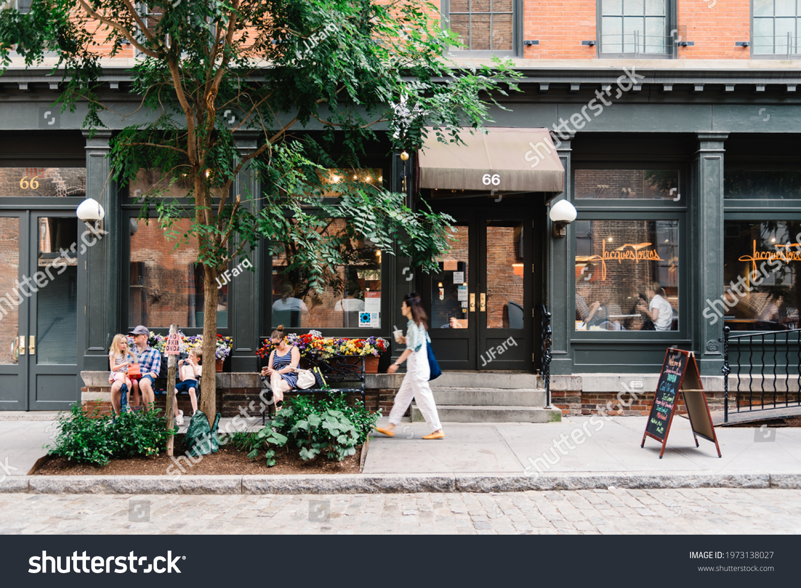
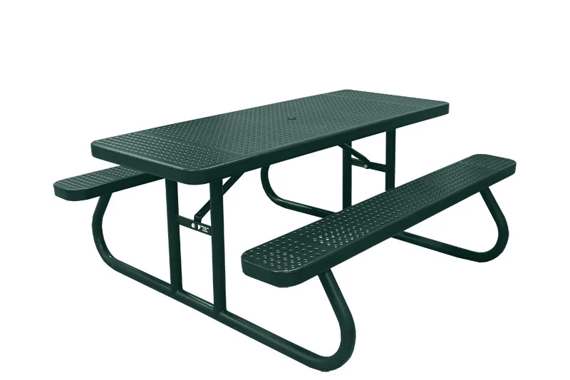

[**<< Go back**](../../Task%20flow.md)

# United States

The United States is a diverse and culturally rich country, and its storefronts reflect a wide range of unique cultural elements. Here are some distinctive features associated with storefronts in the United States:

1. **Diverse Cuisine**: The United States is a `melting pot of cultures`, and this is reflected in its storefronts, particularly in `urban areas`. You'll find a vast array of international restaurants, `food trucks`, and `cafes offering cuisines from around the world`, including Mexican, Chinese, Italian, Indian, and many others.

2. **Fast Food Chains**: The U.S. is known for its `fast-food culture`, and iconic fast-food chains `like McDonald's`, `Burger King`, and `Taco Bell` have easily recognizable storefronts with colorful signage and drive-thru windows.

3. **Diners**: Traditional American diners are characterized by their `retro-style storefronts with neon signs`, `chrome detailing`, and `booths`. They often serve classic American comfort food.

4. **Food Trucks**: Food trucks are a unique American phenomenon, with colorful and often creatively designed vehicles serving a variety of street food, from `gourmet taco`s to `gourmet cupcakes`.

5. **Shopping Malls**: <mark>Shopping malls</mark> are a quintessential part of American culture, and their storefronts offer a wide range of retail experiences, from `department stores` to specialty boutiques.

6. **Coffee Shops**: Coffee culture is prevalent in the U.S., and you'll find a multitude of coffee shop chains like `Starbucks`, as well as independent cafes with cozy and inviting storefronts.

7. **Craft Breweries**: The craft beer movement in the U.S. has led to the rise of craft breweries, often housed in storefronts with unique and artistic branding, and some even have taprooms for tastings.

8. **Farmers' Markets**: `Farmers' markets` are popular across the country, and their storefronts (often stalls or tents) showcase locally grown produce, artisanal foods, handmade crafts, and more.

9. **Artisanal Bakeries**: In recent years, there has been a resurgence of artisanal bakeries with storefronts offering handmade `bread`, `pastries`, and other `baked goods`, often with a focus on high-quality, locally sourced ingredients.

10. **Bookstores**: `Independent bookstores` and national chains like Barnes & Noble offer a diverse selection of books and often have inviting storefronts with `window displays promoting` `new releases` and `bestsellers`.

11. **Record Stores**: Some cities still have independent record stores with distinctive storefronts, selling vinyl `records`, `CDs`, and `music` memorabilia.

12. **Thrift and Vintage Shops**: Thrift stores and vintage shops often have eclectic and unique storefronts, and they offer a treasure trove of secondhand clothing, furniture, and collectibles.

13. **Entertainment Venues**: Storefronts for `theaters`, `music venues`, and `comedy clubs` often feature <mark>eye-catching signage and posters promoting upcoming events.</mark>

14. **Tattoo Parlors**: `Tattoo parlors` often have distinctive and edgy storefronts, and they are a part of the contemporary American art and body modification culture.

15. **Historic Storefronts**: In some towns and cities, you'll find preserved or restored historic storefronts, which offer a glimpse into the architectural and commercial history of the region.

16. **Drive-In Theaters**: While less common than in the past, drive-in theaters still exist in some areas, with unique storefronts showcasing movie posters and retro signage.

17. **Art Galleries**: Art galleries in major cities have stylish and contemporary storefronts, often with large windows showcasing artworks to passersby.

These cultural elements associated with U.S. storefronts reflect the country's diversity, entrepreneurial spirit, and evolving consumer preferences, making them an integral part of American culture and commerce.

## Reference images

[**<< Go back**](../../Task%20flow.md)