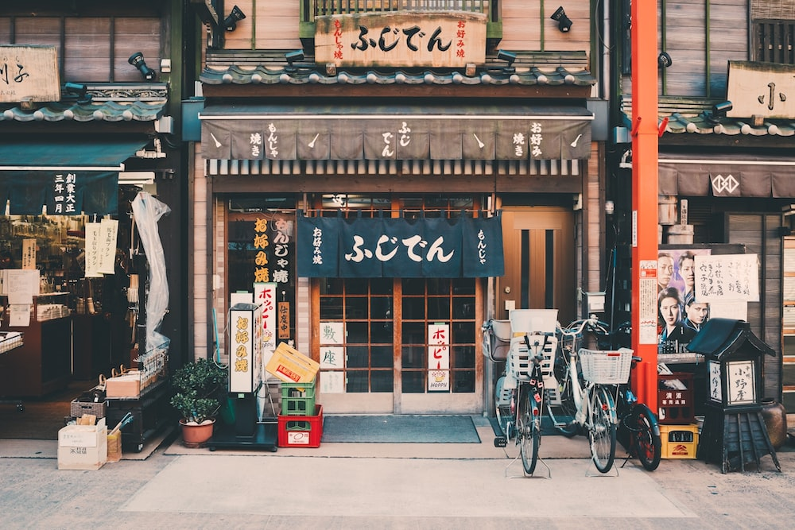

[**<< Go back**](../../Task%20flow.md)

# Japan

Japan has a rich and unique cultural heritage, and its storefronts often reflect a blend of tradition, craftsmanship, and modern innovation. Here are some distinctive cultural elements associated with storefronts in Japan:

1. **Noren Curtains**: Many traditional Japanese storefronts, especially in <mark>older neighborhoods</mark> and <mark>ryokans (traditional inns)</mark>, feature noren `curtains hanging in the entrance`. These fabric dividers often bear the shop's name or logo and add a touch of traditional Japanese charm.

2. **Izakayas and Yakitori Stands**: <mark>Izakayas</mark> are traditional Japanese pubs, and <mark>yakitori</mark> stands are places specializing in skewered `grilled chicken`. These storefronts often have <mark>simple wooden facades</mark> and <mark>traditional lanterns</mark> (chochin) hanging outside.

3. **Tea Houses (Chashitsu)**: <mark>Tea houses</mark> and `tea ceremony schools `may have modest yet elegant storefronts featuring traditional tea `utensils`, `tatami mats`, and `ikebana` (`flower arrangements`).

4. **Sushi Restaurants**: <mark>Sushi restaurants</mark> often have understated and minimalist storefronts. You might see a simple noren curtain, a `sushi bar visible through the window`, or `plastic replicas of dishes to help customers choose their meal`.

5. **Kaiseki Restaurants**: `High-end kaiseki restaurants` often have discreet and unassuming storefronts that offer a sense of exclusivity and privacy. Some may have sliding <mark>wooden doors</mark> and traditional Zen garden elements.

6. **Ramen Shops**: <mark>Ramen shops</mark> typically have more casual storefronts, often with colorful signage and plastic models of the menu items displayed in the window.

7. **Temples and Shrines**: The entrances to 1 and `shrines` often serve as storefronts for spiritual experiences. Visitors can purchase charms, amulets, or pay their respects at these sacred sites.

8. **Depachika**: The basement food floors of department stores, known as "depachika," are bustling with food stalls and storefronts offering a wide variety of Japanese and international cuisines. The `colorful displays are a feast for the eyes.`

9. **Traditional Craft Shops**: Storefronts specializing in traditional crafts like pottery, textiles, and lacquerware often feature exquisite window displays of artisanal goods and demonstrate traditional craftsmanship techniques.

10. **Kimono Shops**: <mark>Kimono shops</mark> may display beautifully patterned `kimono fabric samples` in their storefronts, showcasing the elegance of `traditional Japanese clothing`.

11. **Manga and Anime Stores**: Stores dedicated to manga and anime often have vibrant and eye-catching storefronts adorned with posters and life-sized character cutouts.

12. **Electronics Stores**: <mark>Electronic storefronts</mark> in places like Akihabara, Tokyo, often have futuristic and neon-lit facades, reflecting Japan's technological prowess.

13. **Sake Shops (Sakaya)**: <mark>Sake shops</mark> may have wooden storefronts with sake barrels (sugidama) hanging outside. Some also offer tastings and have an extensive selection of `sake bottles on display`.

14. **Kimonoya**: Shops specializing in kimono and yukata often display traditional clothing in their storefronts, sometimes with `mannequins dressed` in seasonal ensembles.

15. **Japanese Confectionery Shops (Wagashi-ya)**: `Traditional wagashi` shops often have beautifully crafted and seasonal sweets displayed in their windows, making them visually appealing and tempting.

16. **Tatami Mat Stores**: Stores selling <mark>tatami mats</mark> may have samples or examples of different tatami designs in their storefronts.

17. **Bonsai Nurseries**: Bonsai nurseries may have an assortment of miniature trees on display in their storefronts, showcasing the art of bonsai cultivation.

These cultural elements associated with Japanese storefronts offer a glimpse into the country's deep-rooted traditions, culinary diversity, and appreciation for craftsmanship, all of which contribute to the unique charm of Japan's commercial spaces.

## Reference images

[**<< Go back**](../../Task%20flow.md)