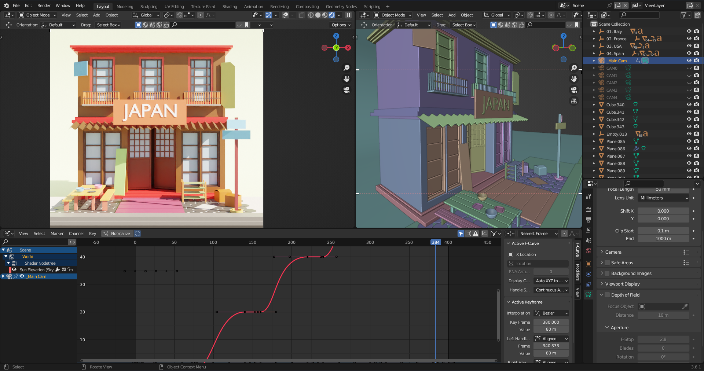

# Assignment-Intern-3D-Generalist
 2023/05/10 a comany gave me an assignment to do for the internship.

## Task 1: Research and Selection of Storefronts

- [X] Research and compile a list of culturally diverse-- locations around the world.
    - Collected References
        - [Us News : best countries, rankings, influence](https://www.usnews.com/news/best-countries/rankings/influence)
        - [Innovative Zone India : best cultures in the world2023](https://innovativezoneindia.com/best-cultures-in-the-world-2023/)
    
- [X] Conduct in-depth research on each location to understand the <mark>unique cultural elements</mark> associated with their storefronts.
    - Selected Countries
        - Italy [_see more_](./Task%201/01.%20Italy/unique%20cultural%20elements.md)
        - France [_see more_](./Task%201/02.%20France/unique%20cultural%20elements.md)
        - United States [_see more_](./Task%201/03.%20United%20States/unique%20cultural%20elements.md)
        - Spain [_see more_](./Task%201/04.%20Spain/unique%20cultural%20elements.md)
        - Japan [_see more_](./Task%201/05.%20Japan/unique%20cultural%20elements.md)

- [X] Select 5 unique storefronts from different cultural locations based on research.

- [X] Prepare a document summarizing your research findings and the rationale for your selections.
    - [Summary File](./Task%201/elements%20summary.md)

## Task 2: Design and Rendering

- [X] Choose one storefront from your selected list for the render showcase.
- [X] Collect reference images and materials related to the selected storefront.
- [X] Create a 3D model of the selected storefront in a low-poly style.
- [X] Set up appropriate lighting conditions in the 3D scene to reflect the cultural location and time of day.
- [X] Render the 3D scene and ensure it is visually appealing and professional.
    - [Draft view](./Render%20Snaps/Draft%20Render%20out/wirefranmeout.md)
    - [Final Render Snaps](./Render%20Snaps/Final/finalrender.md)

## Task 3: Animation and Storytelling

- [X] Plan a narrative or story that relates to the selected storefront's cultural context.
    - Markets all around the world. specifically selected counties in here.
- [X] Create a storyboard or script to outline the key elements of the animation.
    - Camera move thorugh the stores one by one after showing the title at first.
- [X] Animate the low-poly render to tell the chosen story, incorporating cultural details.
- [X] Ensure smooth and engaging animations that align with the storytelling concept.
- [X] Mention the animation process, including software used and techniques applied.
    - <mark>Blender 3D is used to do modeling and rendering (Cycles render engine)</mark>
    - <mark>No Plugines are user.</mark>
    - <mark>All the objects and created from the starch</mark>
    

## Task 4: Final Review and Feedback

- [X] Conduct a thorough review of all project components, ensuring they meet the client's objectives.
- [ ] Request feedback from peers or mentors to identify areas for improvement.
- [ ] Make any necessary revisions based on feedback.
- [X] Double-check for any errors or inconsistencies in your documentation and presentation.

[Final Animation video](https://drive.google.com/file/d/1nOcSnEuZ2vHsmbf4CkOE9OLZ9XAikmLO/view?usp=sharing)
## Task 6: Submission

- [X] Package all project files, including 3D models, renders, animations.
- [ ] Prepare a clear and concise cover letter or email for submission.
- [X] Submit the complete project to PixelSprout according to their specified guidelines and deadlines.

